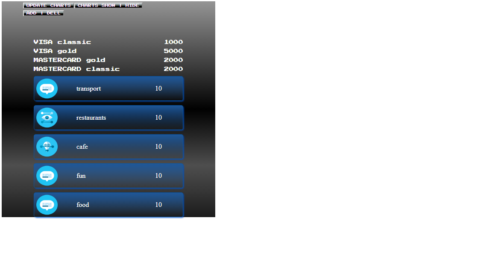
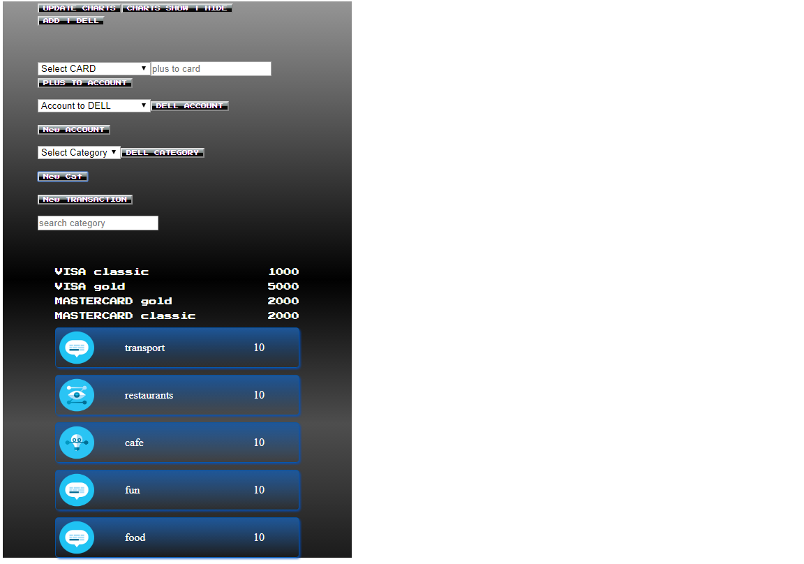
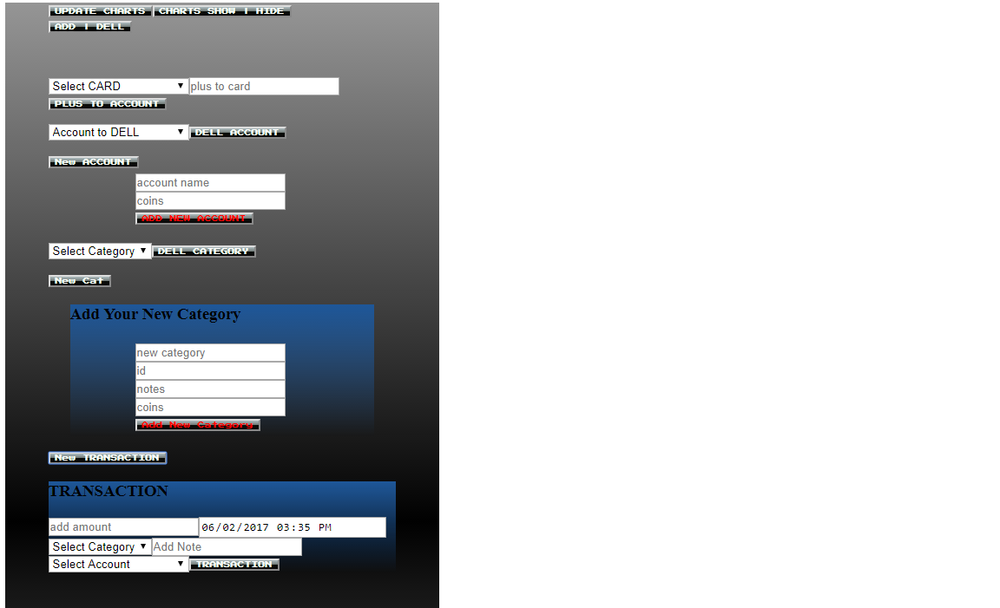
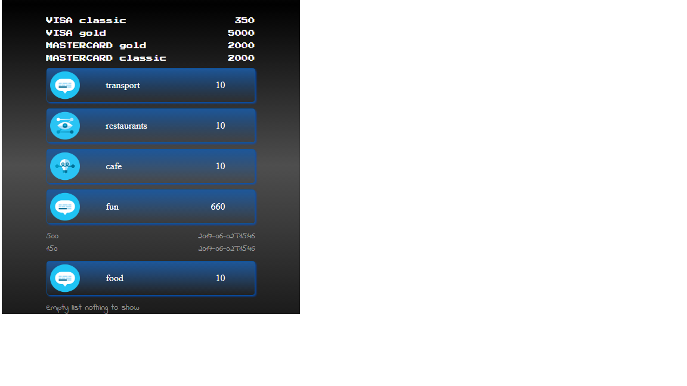
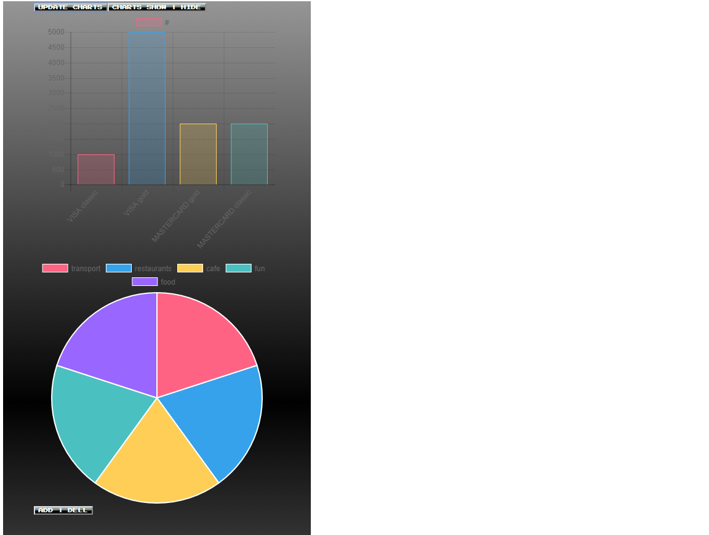

# WEB_UI_2017
project files

## This is my React project for LITS

    it's application for monitoring your own  budget

_program has such options_

   * Show & hide & update charts
     * _Charts are in bars for Accounts_
     * _Charts are in Pie for Categories_
   * PLUS money to Account
   * DELL Accounts, Categories
   * Create new Accounts, Categories
   * Add new transaction
     * _in new transaction form your can choose category & account_
   * in category on click you can see all transactions or empty list if nothing to show

_in this project I use_
   * React.js
   * JavaScript
   * ES6
   * NPM  from my package.json
   * Webpack 2

_ScreenShots from my React APP_
  
  
  
  
  
